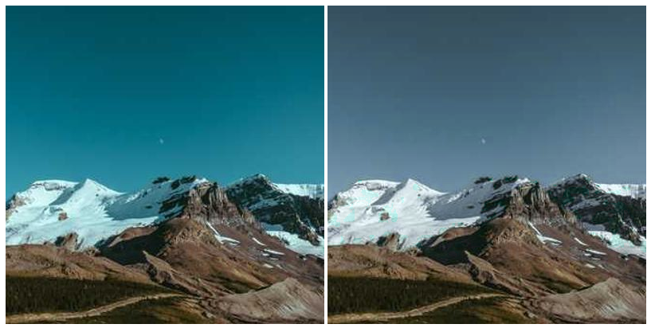
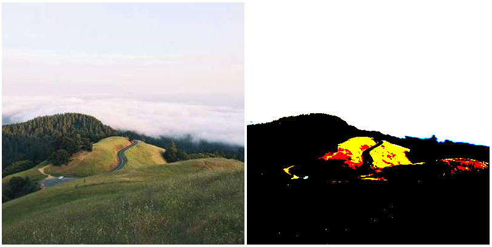
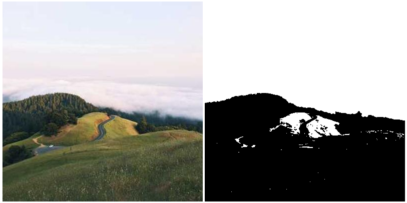
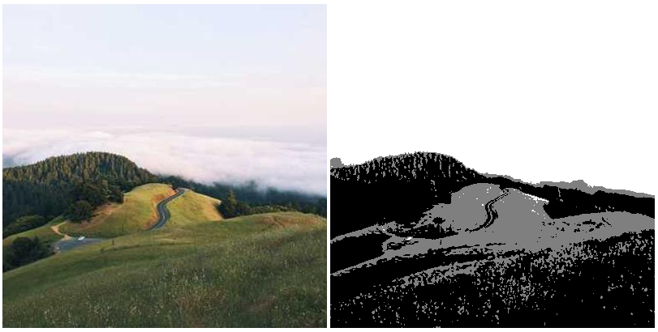
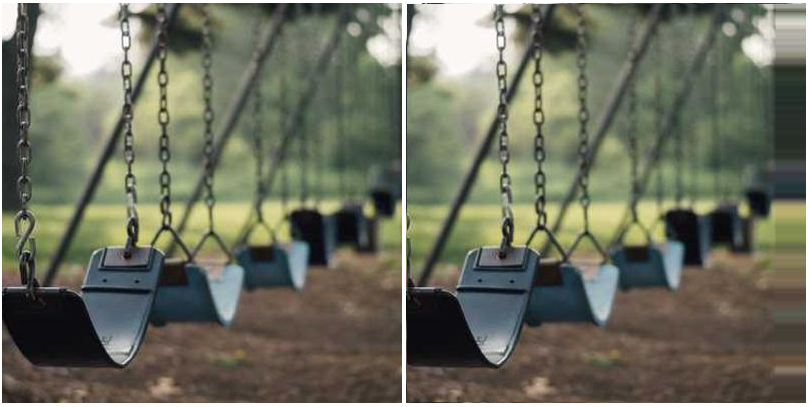

# Picture

## Links

github: [Voldemortas/Picture](https://github.com/Voldemortas/Picture)\
jsr: [@voldemortas/picture](https://jsr.io/@voldemortas/picture)

## Instalation

To add it to your dependencies use one of the following

```bash
deno add jsr:@voldemortas/picture
pnpm i jsr:@voldemortas/picture
yarn add jsr:@voldemortas/picture
npx jsr add @voldemortas/picture
bunx jsr add @voldemortas/picture
```

And import with

`import Picture, {Pixel, Kernel} from "@voldemortas/picture";`\
or\
`import Picture, {Pixel, Kernel} from "jsr:@voldemortas/picture";`\
or if using browser:\
`import Picture, {Pixel, Kernel} from "https://esm.sh/jsr/@voldemortas/picture"`

## Usage

You can check the functionalit by visiting
https://raw.githack.com/Voldemortas/picture/master/example/index.html.

### Preparation

You can get image data using
[`CanvasRenderingContext2D.getImageData()`](https://developer.mozilla.org/en-US/docs/Web/API/CanvasRenderingContext2D/getImageData)
or other means if you're doing it serverside. And them simply

```ts
//import Picture, prepare context
const imageData = context.getImageData(0, 0, width, height)
let picture = Picture.from(imageData)
```

---

### Picture

#### Initializing and data structures

The `Picture` object/class works with 4 pixel channels: RGBA, however it
provides functionality to (de)construct it from/to RGB kind of data.

```ts
const WIDTH = 1
const HEIGHT = 2
//2 pixels, one green, another red, without alpha
const RGB = new Uint8ClampedArray([0, 255, 0, /*next pixel*/ 255, 0, 0])
//2 pixels, one green, another red, with alpha
const RGBA = new Uint8ClampedArray([0, 255, 0, 255, /*next*/ 255, 0, 0, 255])
const p1 = new Picture(WIDTH, HEIGHT, RGB)
const p2 = new Picture(WIDTH, HEIGHT, RGBA)
const p3 = Picture.From(WIDTH, HEIGHT, RGB)
const p4 = Picture.From(WIDTH, HEIGHT, RGBA)
// all pictures p1 to p4 hold the same data
const p5 = p1.toObject()
// {
//   width: 1,
//   height: 2,
//   data: RGBA
//   channels: 4,
// }
const p6 = p1.toNoAlphaObject()
// {
//   width: 1,
//   height: 2,
//   data: RGB
//   channels: 3,
// }
```

#### Pixel/channel manipulation

The library provides a way to manipulate each pixel by providing a callback of
type

```ts
(channels: number[], index?: number) => [number, number, number, number]
//or
(channels: number[], index?: number) => [number, number, number]
```

In the latter case the alpha becomes `255` (or `FF` in hex if you may). So you
can do stuff like

```ts
//makes the red channel green, green - blue, blue - red
picture.manipulateChannels(([r, g, b]) => [g, b, r])
//makes every 4th channel black
picture.manipulateChannels(([r, g, b], i) => i % 4 !== 0 ? [r, g, b]: [0, 0, 0]))
//picks up blue pixels and make them less red and more green thus making the blue appear more gray
//without altering other pixels
picture.manipulateChannels(([r, g, b]) => (b >= r && b >= g) ? [r * 1/3 + 2/3 * g, g, b] : [r, g, b])
```

\
left - original, right - the last manipulation result

#### monochromize()

You can make the image grayscaled - black - gray - white making all the
non-alpha values the same.

```ts
//uses default monochromization
picture.monochromize()
//puts more weight for blue and less weight for green channels for monochromization
//note that it's better if the values add up to 1
picture.monochromize([2 / 3, 1 / 6, 3 / 6])
//monochromizes and then makes all darker shades appear more red
picture.monochromize().manipulate(([r]) => [255, r, r])
```

\
left - original, right - the monochromized with the default values

#### binarizeColors()

makes the channel be capable of carrying either `0` or `255`, you can pass an
optional `tolerance` value to change when the channel becomes black/white

```ts
picture.binarize(200) //values higher than 200 become 255, values equal or below 200 become black
```

\
left - original, right - the binarized

\
left - original, right - firsly monochromized, then binarized

#### groupColors

Similar to binarization, however it lets you have more than 2 extreme values.

```ts
picture.groupColors([1, 1, 1])
//each channel can have one of the possible 3 values (0, 127, 255)
//values between 0-84 become 0
//values between 85-170 become 127
//values between 171-255 become 255
//this because 256/3-1=84

picture.groupColors([1, 2, 1])
//each channel can have one of the possible 3 values (0, 127, 255)
//values between 0-63 become 0
//values between 64-191 become 127
//values between 192-255 become 255
//this because 256/4-1=63 yet the middle ratio is twice as big
//as the other
```

\
left - original, right - firsly monochromized, then grouped with `[1, 1, 1]`

#### Convolve

You can convolve the picture using custom or built in [kernels](#Kernel).

```ts
new Array(40).forEach(() => {
  picture = picture.convolve([[0, 0, 0], [1, 0, 0], [0, 0, 0]])
})
```

\
what happens if you run the code above

#### findCoordsToConvolveKernel

A _static_ method that finds which indices are needed to be used with the Kernel
as the image is rectangular yet pixels are encoded linearly.

```
0 1 2
3 4 5
6 7 8
```

The _direct_ neighbours of the pixel `4` are `[1, 3, 5, 7]` and the pixel `2`
only has 2 neighbours: `[1, 5]`.

```ts
const imageWidth = 3
const imageHeight = 3
//the pixel id is 2 as from the above
const pixelX = 2
const pixelY = 0
const kernelWidth = 3
const kernelHeight = 3
const imagePixelIds = Picture.findCoordsToConvolveKernel(
  [imageWidth, imageHeight],
  [pixelX, pixelY],
  [kernelWidth, kernelHeight],
) //[undefined, 5, 4, undefined, 2, 1, undefined, undefined, undefined]
//undefined - index does not exist
```

```
0 ➀ ❷  
3 ➃ ➄  
6 7 8
```

As the pixel was ❷, the pixels in question needed for convulation are shown in
black circles.

---

### Pixel

`Pixel` is a static class full of helpers to manipulate a single pixel made of
`[r, g, b, a?]` channels.

All of the `Pixel` methods return a `PixelCallback`!

```ts
type PixelCallback = (
  rgb: [number, number, number, number?],
  index?: number,
) => [number, number, number, number?]
```

#### binarize colors

same as Picture.binarizeColors()

```ts
const pixel = [0, 127, 255]
Pixel.binarizeColors(pixel, 127) //[0, 0, 255]
//as 255 > 127, 127 <= 127 and 0 <= 127
```

#### monochromize

same as Picture.monochromize()

```ts
const pixel = [244, 127, 63]
//only considers the red channel when monochromizing data
const rgbRatio = [1, 0, 0]
Pixel.monochromize(rgbRatio)(pixel) //[244, 244, 244]
//because the red channel was 244
```

#### group colors

same as Picture.groupColors()

```ts
const pixel = [244, 127, 70]
Pixel.groupColors([1, 1, 1])(pixel) //[255, 127, 0]
Pixel.groupColors([1, 2, 1])(pixel) //[255, 127, 127]
```

### Comparator

Static class with methods to compare pixel (rgba channels)

#### AlphaOption

`AlphaOption` is an enum used to describe how alpha channels should be treated

```ts
export enum AlphaOption {
  /** ignores alpha channels */
  ignore = 'ignore',
  /**
   * cares about alpha channels and multiplies pixel's rgb channels by their transparancy
   * for comparison sake
   * [127, 255, 255, 127] gets treated as if it were [63, 127, 127, 255]
   * applies to both pixels in comparison
   */
  multiply = 'multiply',
  /**
   * cares about alpha channels and multiplies pixel's rgb channels by their transparancy
   * for comparison sake
   * [127, 255, 255, 127] gets treated as if it were [63, 127, 127, 255]
   * applies to the `b` pixel only
   */
  ignoreFirst = 'ignoreFirst',
  /**
   * cares about alpha channels, however, instead of multiplying rgb channels by their
   * transparency, it just does simple `Math.abs(a[3] - b[3])`
   */
  compare = 'compare',
}
```

#### comparePixels()

```ts
const P1 = [255, 0, 0, 63]
const P2 = [0, 255, 0, 127]
```

```ts
//255 of red + 255 of green + 0 of blue = 510; alpha channel is ignored
Comparator.comparePixels(P1, P2, AlphaOption.ignore)
//255 of red + 255 of green + 0 of blue = 510; alpha channel is ignored
Comparator.comparePixels(P2, P1, AlphaOption.ignore)

//255 of red + 127 of green + 0 of blue = 382; alpha channel of 2nd is ignored
Comparator.comparePixels(P1, P2, AlphaOption.ignoreFirst)
//63 of red + 255 of green + 0 of blue = 318; alpha channel of 2nd is ignored
Comparator.comparePixels(P2, P1, AlphaOption.ignoreFirst)

//255 of red + 255 of green + 0 of blue + 64 of alpha = 574
Comparator.comparePixels(P1, P2, AlphaOption.compare)
//255 of red + 255 of green + 0 of blue + 64 of alpha = 574
Comparator.comparePixels(P2, P1, AlphaOption.compare)

//63 of red + 127 of green = 190
Comparator.comparePixels(P1, P2, AlphaOption.multiply)
//63 of red + 127 of green = 190
Comparator.comparePixels(P2, P1, AlphaOption.multiply)
```

#### compareMultiplePixels()

same as simple pixel to pixel comparison but can compare arrays instead, arrays
must be the same length, however, it supports `undefined` pixels for which you
can set the `undefinedScore` (by default `255 * 3` - 3 channels)

```ts
//510 + 255 * 3 = 1275
Comparator.compareMultiplePixels([P1, undefined], [P2, P1], AlphaOption.ignore)
//510 + 0 = 510
Comparator.compareMultiplePixels(
  [P1, undefined],
  [P2, P1],
  AlphaOption.ignore,
  0,
)
```
